# Task: Create an EC2 instance then install Apache Server on it.

## 1. Security Group 
- Create Security Group for Apache Web Server and SSH

### Open EC2 service and create a Security Group

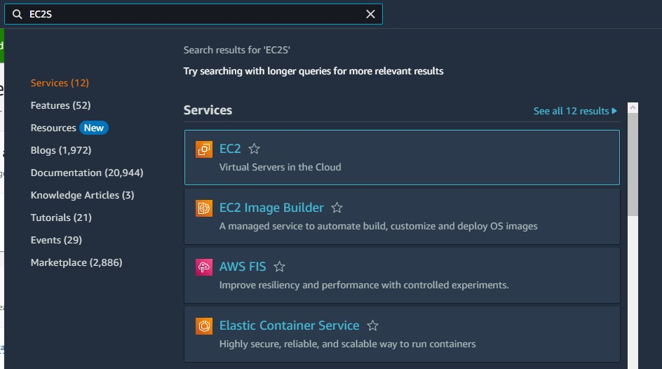
---
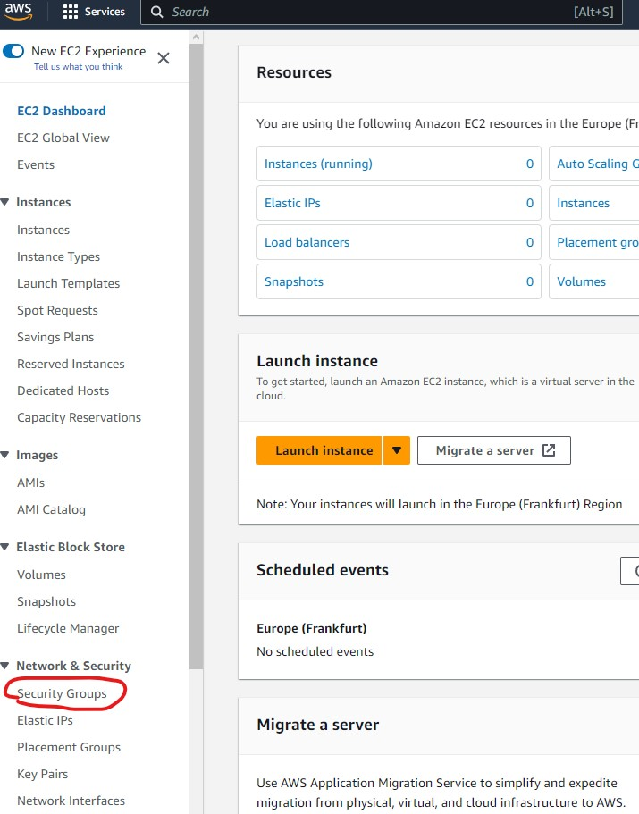
---


### Giving name to SG & Adding inbound rules

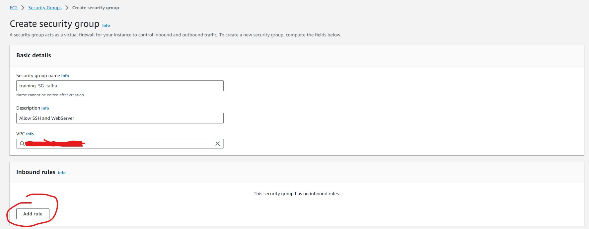
---
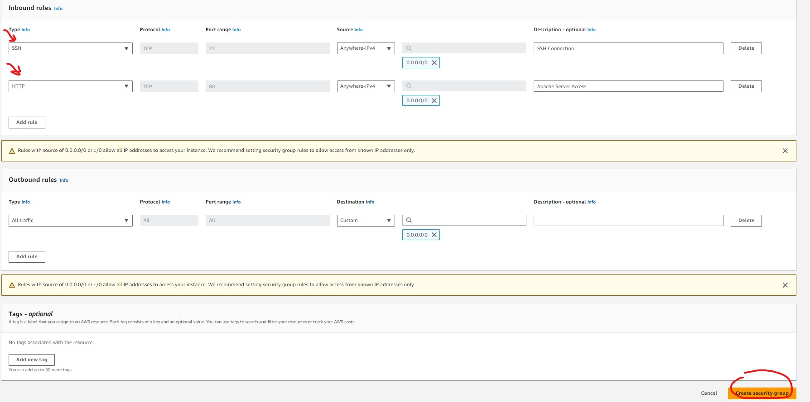

## 2. EC2 Instance

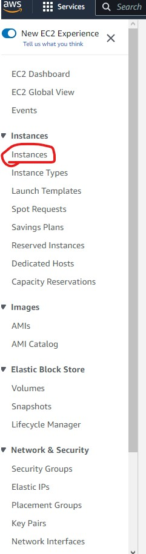

### Create EC2 instance

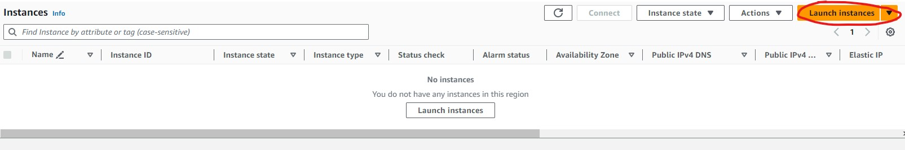

### EC2 details

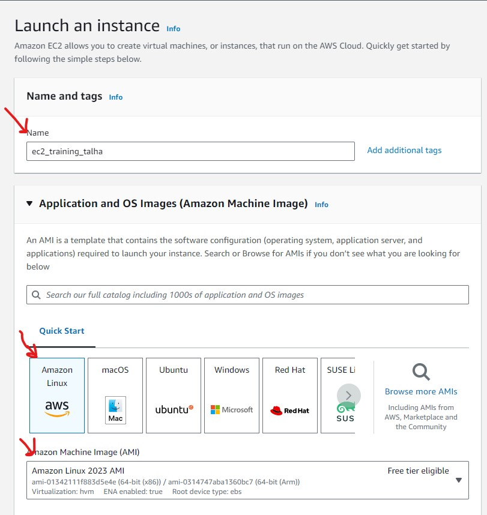
---
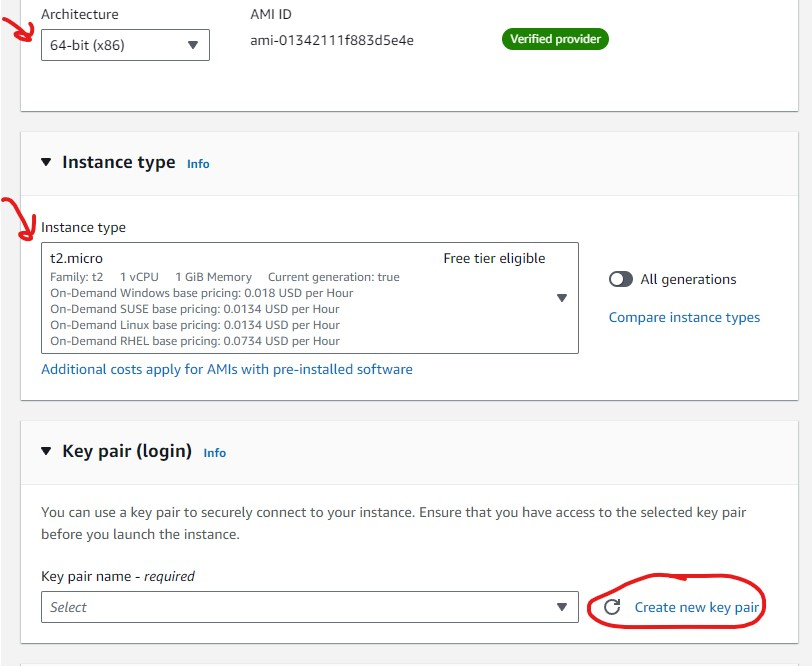
---
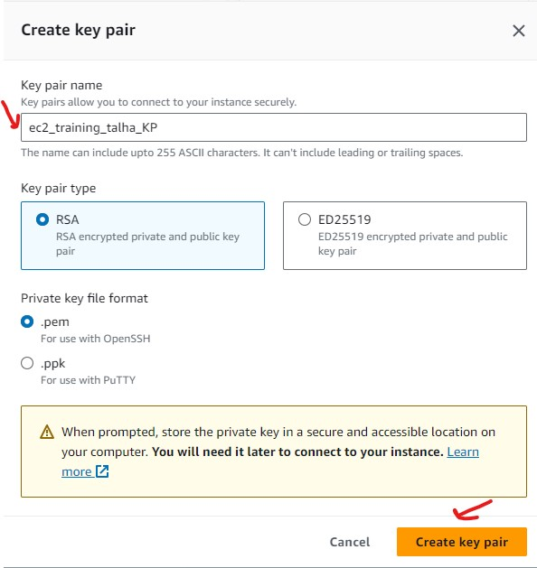
---
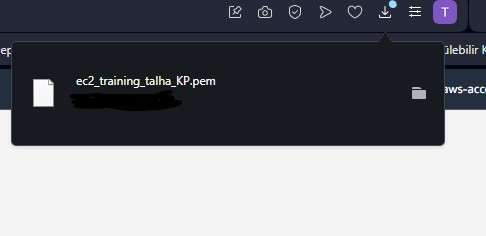
---
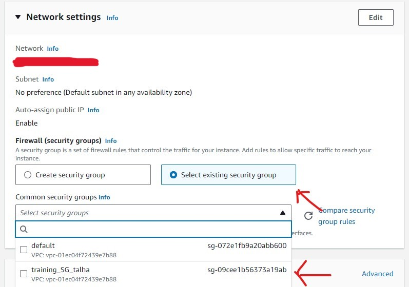
---
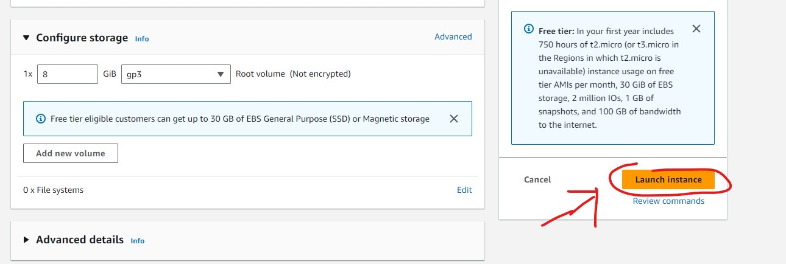

## 3. Connect EC2 and install Apache Server

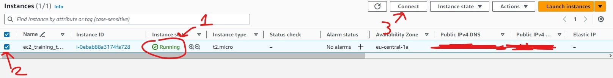
---
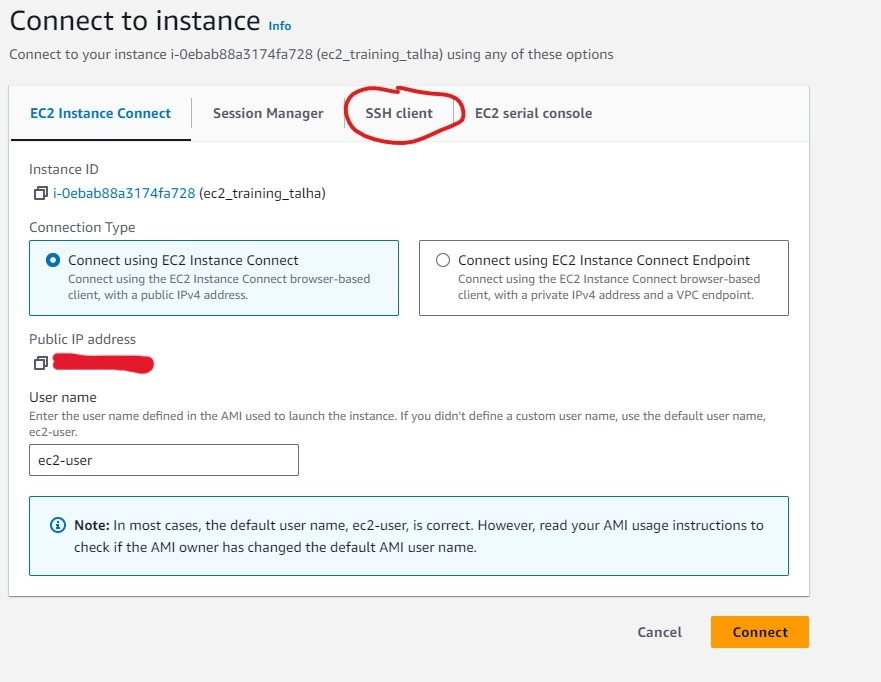
---
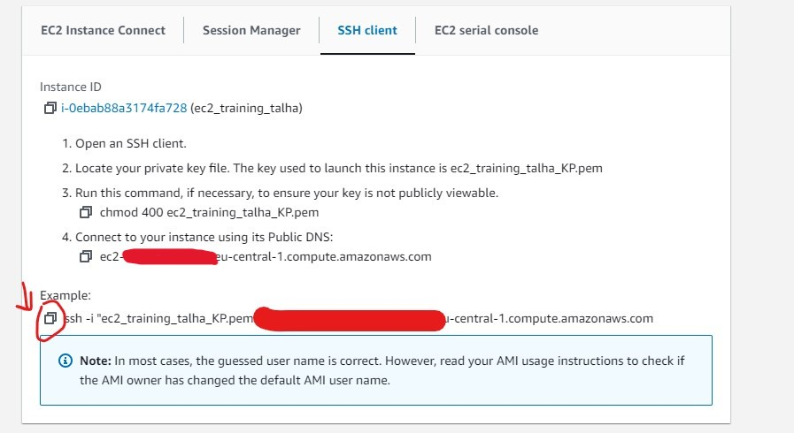
---

### Open a command prompt (cmd) or terminal, enter to the folder which key pair exists, paste the command line you've copied from AWS:

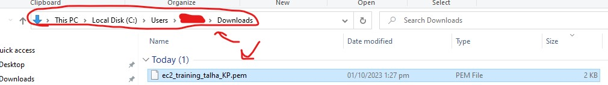
---
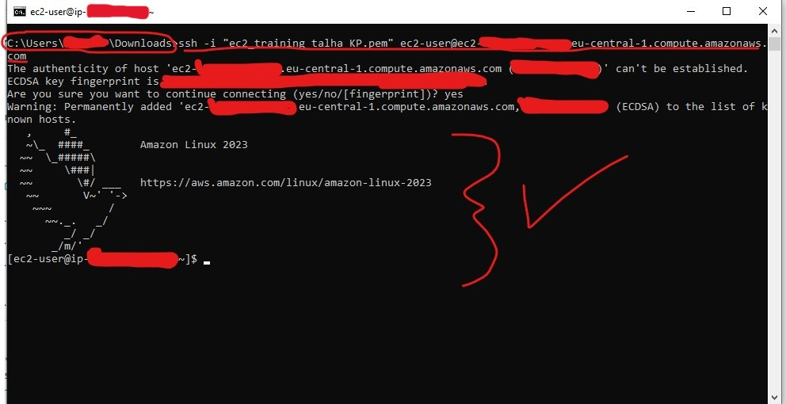
---

### Install requirements to EC2 machine:

```commandline
#!/bin/bash
sudo yum update -y
sudo yum install -y httpd
sudo systemctl enable httpd
sudo service httpd start
sudo echo '<h1>Welcome to VBO AWS Data Enegineering</h1>' | sudo tee /var/www/html/index.html
sudo mkdir /var/www/html/app1
sudo echo '<!DOCTYPE html> <html> <body style="background-color:rgb(250, 210, 210);"> <h1>Welcome to VBO AWS Data Enegineering</h1> <p>Application Version: V1</p> </body></html>' | sudo tee /var/www/html/app1/index.html
sudo curl http://169.254.169.254/latest/dynamic/instance-identity/document -o /var/www/html/app1/metadata.html
```

## 4. Open browser and see result
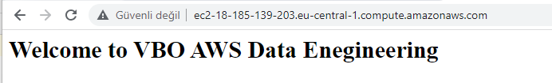

---

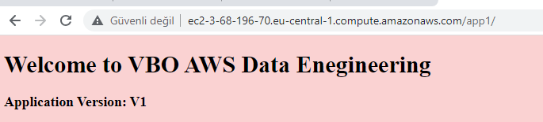


## 5. Terminate instance
