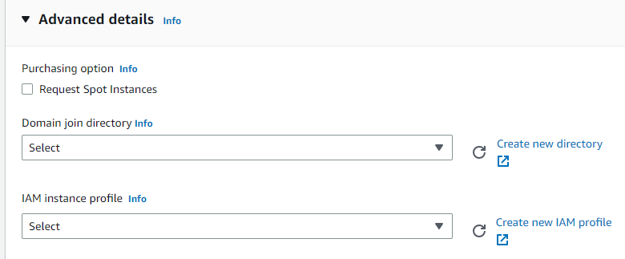
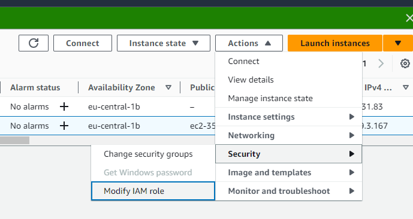

## Create IAM Role
- EC2 -> Access management -> 
    Roles -> 
    Create role -> 
    AWS Service (EC2) -> 
    Add permissions (AmazonS3FullAccess)

## Create EC2 Instance
- While creating you can attach the role to instance



---

- After created



---

### SSH connection
 `ssh -i  <your_pem> ec2-user@<public_ip>`
 
### S3 bucket list
```python
aws s3 ls
```

## Terminate instance
