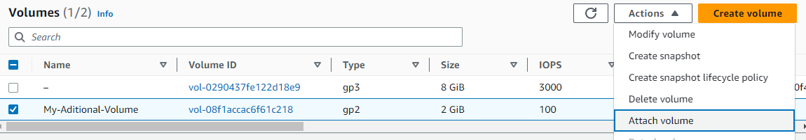

## create instance

## From Networking learn Availability Zone (AZ)

## Connect instance
```
[ec2-user@ip-172-31-44-74 ~]$ lsblk
NAME      MAJ:MIN RM SIZE RO TYPE MOUNTPOINTS
xvda      202:0    0   8G  0 disk
├─xvda1   202:1    0   8G  0 part /
├─xvda127 259:0    0   1M  0 part
└─xvda128 259:1    0  10M  0 part
```

## Create volume in the same AZ with instance



---

## Attach volume to instance

## Mount volume to /data folder
- See the volume
```
lsblk
NAME      MAJ:MIN RM SIZE RO TYPE MOUNTPOINTS
xvda      202:0    0   8G  0 disk
├─xvda1   202:1    0   8G  0 part /
├─xvda127 259:0    0   1M  0 part
└─xvda128 259:1    0  10M  0 part
xvdf      202:80   0   2G  0 disk
```
- Format the volume
```
sudo mkfs -t xfs /dev/xvdf
```
- Create /data folder
```
sudo mkdir /data
```
- Mount volume to /data folder
```
sudo mount /dev/xvdf /data
```
- Create some fıle in /data

## Create another EC2 instance

## Terminate first instance

## Attach volume to new (second) instance
- Create /data
- Mount volume

## Terminate instance (second)

## Delete volume