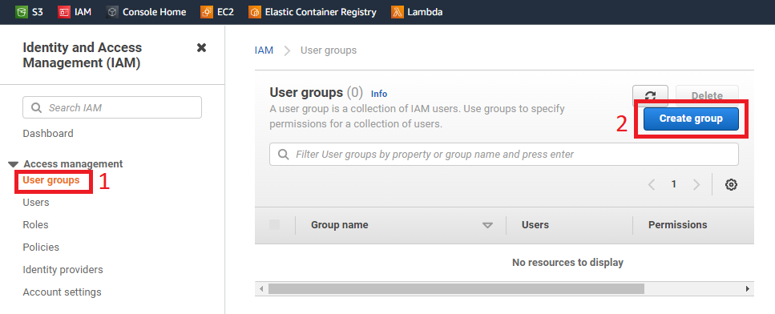

## 1. SignIn with root account

----------------

## 2. Create an admin account
- After first sign-in and create admin account you barely use root account.
- It is the best security practice not to use root account.

### 2.1. Create admin group
#### Open iam service

------------------

#### Create a user group

--------------------

#### Attach permission to group
1. Name the group. Ih here **admin** used.
2. Filter permission policies. User AdministratorAccess filter.
3. Select built-in AdministratorAccess policy.

----------------

- Click Create Group

#### See the group

-------------------

### 2.2. Create admin user
#### Add user

------------------

#### User details

------------------

#### Set permissions
- Note that we have just created above this admin group.

------------------

#### Continue with defaults following steps

#### Download credentials csv

---------------

